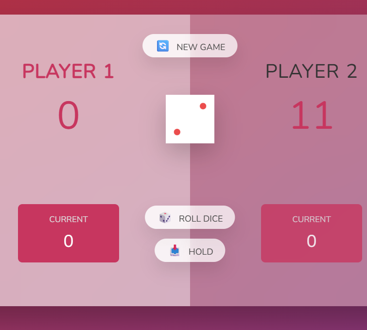

# Pig Game
 A short game where you need to reach 100 points before your opponent. 
 This game is an adaptation of a JavaScript course project, on this version you can play alone against a little bot.

 ## How to play:
 Whenever you click on "Roll dice" the number you got on the dice will go to your current score.
 Whenever you click on "Hold" the amount of points you got will go to your score and you will pass your turn to the bot.
 If you get an 1 on the dice, you lose all your current score and lose your turn.
 The first to reach 100 points win.
 Click on "New game" to restart the game.
